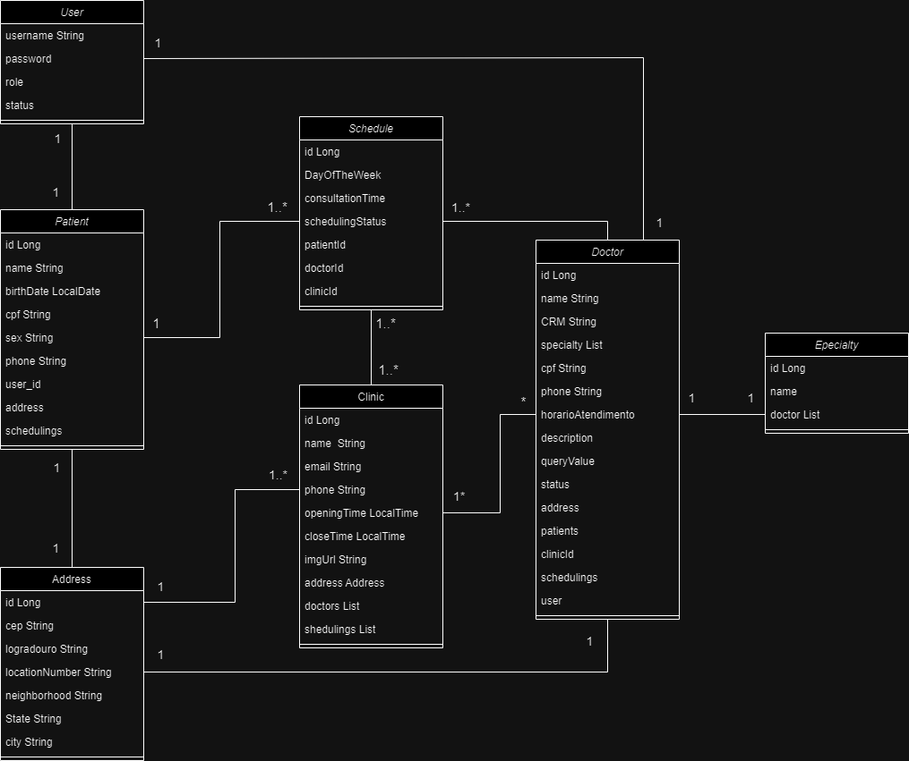

# ApiMediServe

# 📋 Descrição do Projeto
Esta API RESTful foi desenvolvida para gerenciar o funcionamento de uma clínica médica, oferecendo recursos para cadastro de pacientes, médicos, especialidades, clínicas e agendamentos de consultas.
Com ela, é possível:

- ``Cadastrar e consultar pacientes e médicos``

- ``Registrar especialidades médicas e associá-las aos médicos``

- ``Definir os horários de atendimento dos médicos (agenda semanal)``

- ``Cadastrar clínicas e seus endereços``

- ``Realizar agendamentos de consultas, vinculando paciente, médico, clínica, dia da semana e horário``

- ``Garantir que os horários disponíveis respeitem a agenda do médico e o limite de atendimentos por período.``

A aplicação foi construída com Java, Spring Boot, JPA/Hibernate e segue boas práticas de desenvolvimento como separação por camadas, uso de DTOs e tratamento centralizado de exceções.

## Diagrama de Classes (Domínio da API)

## ✔️ Técnicas e tecnologias utilizadas

- ``Java 17``
- ``InteliJ IDEA``
- ``Paradigma de orientação a objetos``
- ``Spring Boot``
- ``Spring Data JPA``
- ``Hibernate``
- ``RESTful APIs``
- ``PostgreSQL``
- ``Maven``
- ``DTO (Data Transfer Objects)``
- ``Swagger``
- ``Insomnia``

## ✔️ Funcionalidades Principais

- ``Autenticação e autorização com JWT``
- ``CRUD de entidades ()``
- ``Tratamento de exceções``
- ``Validação de dados``
- ``Paginação e ordenação de resultados``

